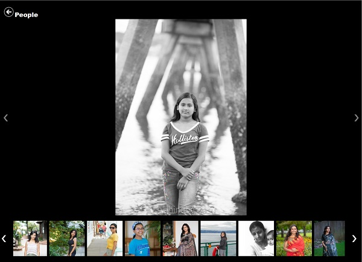

# chobi 
## Introduction
Chobi is a static photo gallery generator. chobi is lansliteration of "ছবি" which means picture in Bengali/Bangla. 

Given a source folder of photos, chobi will generate a destination folder containing the original photos,
generated thumbnails, css stylesheets, scripts and html files which constitute a website displaying those photos as follows



There are a lot of such generator out there, so why build one more you ask. There is two specific reasons
1. I could
2. I needed a feature which I couldn't find in other tools. More on this [below](#Face-Detection)

## Face-Detection
While this tool works as good or as bad as many other photo gallery generator, it does something special for photos with faces
(portraits). I needed the gallery generator to create square thumbnails for the image strip shown at the bottom of the page.
However, the generated thumbnails would simply be either from the center or some other arbitrary location. This meant that 
the thumbnails would cut off at weird places. 

Chobi uses face-detection to ensure that does not happen and the face is always fully present in the generated thumbnail.

Consider the following images and the thumbnails generated without face detection and then with facedetection


| Image                               | Thumbnail                          | Thumbnail with face-detection      |
| :---------------------------------: | :--------------------------------: | :--------------------------------: |
|  |  |  |
|  |  |  |

What these face-detected thumbnails mean is that instead of the photo gallery as in the left below, where in the thumbnails
a lot of heads have been chopped off (literally), you have a much nicer gallery (below right).

| Gallery without face detection    | Gallery __with__ face detection   |
| :-------------------------------: | :-------------------------------: |
|  |  |
 
## How Does it work
I use my other project https://github.com/abhinababasu/facethumbnail to generate face detected thumbnails. Please check that project out as well!

## Build
Get the sources and then run the following command the first time
```
go get
```

Subsequently build using 
```
go build .
```

## Run
The tool needs the facefinder binary that ships with https://github.com/abhinababasu/facethumbnail in the local folder. `go get` run above 
already fetches that repo into your GOPATH. So use the following command to copy facefinder over

```
copy %GOPATH%\src\github.com\abhinababasu\facethumbnail\test\facefinder .
```
Now you can run chobi. Check usage using
```
chobi -h
```

Example below runs the generator with facedetection and verbose mode
```
chobi -name People -src .\test -dst c:\temp -face
```

You can skip the `-face` flag when running this tool for non-portrait albums like Landscapes

## Sample
A sample gallery
[Photography](http://bonggeek.com/Photography/). This was generated by exporting photos from lightroom and then running chobi repeated from those folders into the same target folder.
